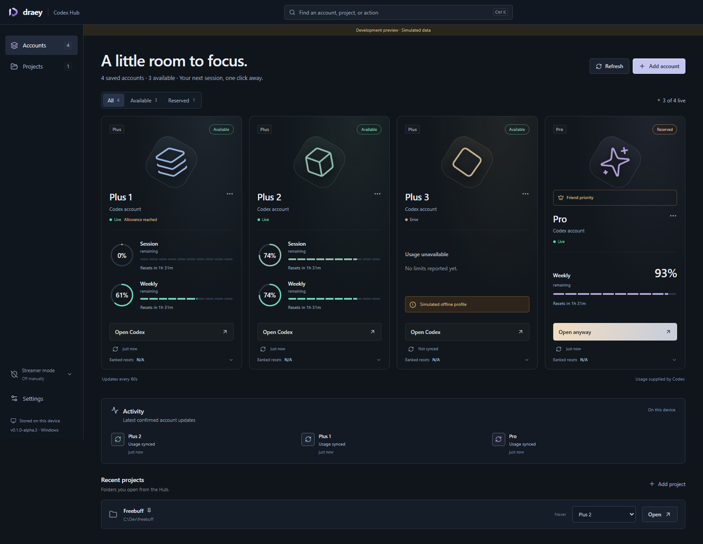

# Draey Codex Hub: Multi-account Codex manager for Windows


**Have more than one Codex account? See your real usage limits in one place and deliberately choose which account to use next.**

Draey Codex Hub is a Windows Codex account manager and usage monitor for developers managing personal, work, or other accounts they are authorized to use. Compare remaining allowances, see reset times, and open Codex from one local dashboard.

[Download for Windows](https://github.com/mithilkatkoria/draey-codex-hub/releases) · [Getting started](#download-for-windows) · [Version history](CHANGELOG.md) · [Contribute](CONTRIBUTING.md)

### Why use it with multiple Codex accounts?

| Your situation | How the Hub helps |
| --- | --- |
| You keep checking limits across several accounts | Startup refresh requests each account's real limits independently. |
| Your accounts have different plans and allowance windows | Account cards display the windows Codex reports, including Pro and additional-model allowances. |
| You want to know when an allowance resets | Remaining usage and reset times appear together, with timestamps for cached data. |
| An account is reserved or has Friend Priority | Keep the preference visible and make an explicit choice before opening it. |
| You want your familiar projects and tasks | The launcher targets the existing Codex workspace; cross-account handoff remains under acceptance testing. |
| You prefer a desktop tool | Use project shortcuts, the system tray, and Ctrl+K on Windows. |

This is an account-management tool, not a way to increase allowances or bypass account restrictions. Every user connects their own authorized accounts. There is no automatic account rotation.

**Early test build:** full real A/B/A account-switch acceptance is still pending. This is an independent community project, not an official OpenAI product.

## Download for Windows

**[Download v0.1.0-alpha.3 for Windows](https://github.com/mithilkatkoria/draey-codex-hub/releases/tag/v0.1.0-alpha.3)**

1. Download **Draey-Codex-Hub-setup.exe** from the release's Assets section and run it. This creates the Start menu shortcut.
2. Open **Draey Codex Hub** from Windows Search. For a portable copy, download the ZIP, extract it, and open **Draey Codex Hub.exe** instead.
3. Install [Codex Desktop](https://developers.openai.com/codex/app/) and [Codex CLI](https://developers.openai.com/codex/cli/) separately; open Codex normally once.
4. Add your own accounts and complete OpenAI sign-in for each. There is no fixed account limit. Three, four, and larger collections adapt to the available window space. No personal accounts are included.

GitHub's automatic **Source code** downloads do not contain the app. Use the attached installer, EXE, or Windows ZIP.

The download is an unsigned x64 Windows test build, also tested on Windows ARM through x64 emulation. It needs [Microsoft Edge WebView2](https://developer.microsoft.com/microsoft-edge/webview2/). If Windows reports a missing Visual C++ runtime DLL, install the [Microsoft x64 Visual C++ Redistributable](https://aka.ms/vs/17/release/vc_redist.x64.exe). Node.js and Rust are not required to run the download. The NSIS installer creates a Start menu shortcut. Signed releases remain future work.

To appear in Windows Search, use the installer rather than just running a portable executable. Search for **Draey Codex Hub** after installation. Installing an update preserves the separate user-folder account store.

## What it does

- Automatically requests real allowances independently for every saved account through Codex `account/rateLimits/read`.
- Displays the windows actually reported, including different Pro and additional-model layouts; missing values remain unknown.
- Preserves Friend Priority and Reserved preferences. Account selection is deliberate, with no automatic rotation or Pro prioritization.
- Offers project shortcuts, Ctrl+K commands, tray support, settings, and timestamped cached values.
- Includes [streamer mode](docs/streamer-mode.md) with Auto, On, and Off. Mask identities, project names, paths, tooltips, forms, and diagnostic details without changing saved accounts or launch targets.
- Uses the existing Codex workspace instead of opening an empty separate desktop profile.

## Updates and resource use

Open **Settings > App updates > View releases on GitHub**. Install the newer setup over your existing installation, or close the portable app and replace its EXE. Your accounts and preferences stay in a separate user folder. This release does not automatically download or install updates. A signed updater and update feed would be needed for automatic installation; see [Tauri updater documentation](https://v2.tauri.app/plugin/updater/).

The Hub uses Windows WebView2 rather than bundling a browser. Its UI uses CSS and SVG, including a short reduced-motion-aware startup animation. Usage requests are capped at three simultaneously, with no limit on saved accounts. Display polling pauses while hidden. WebView2 and temporary Codex app-server processes still consume memory; a universal under-1% RAM promise would be inaccurate.

## Account switching and local data

Choose a saved account in the Hub. The Hub verifies it, requests a normal Codex quit, and opens the same workspace with that login after Codex exits. Save your work and respond to any quit prompt. If needed, use **File > Quit (Ctrl+Q)**. Do not sign out to switch: sign-out can revoke the login the Hub saved. The selected account stays queued for up to ten minutes, with cancellation and independent refresh available. The Hub never force-kills Codex. Full real A/B/A Desktop acceptance remains pending.

Your account entries and credentials are saved locally between launches. If a usage request rejects an expired access token, the Hub asks Codex to renew the saved login once before requiring browser sign-in. A token already revoked by OpenAI cannot be repaired locally; reconnect that account once. A failed network request does not erase an account or its saved login.

Projects, tasks, desktop data, and configuration stay in place. The Hub transfers only local `auth.json` credentials, retains a recovery backup, and serializes switching against its own authentication operations. Finish independent CLI work before switching too. File-based credentials are currently required; other credential-store configurations are preserved and rejected for switching.

The app keeps account slots, settings, and sensitive authentication backups under `%USERPROFILE%\.draey-codex-hub`. On first launch they recover the previous `%LOCALAPPDATA%\dev.draey.codexhub` store, including the copy Windows virtualized inside the Codex package. Original files are preserved. This prevents Explorer launches and launches from Codex from showing different profile lists. The shared workspace remains `%USERPROFILE%\.codex`. **Never upload these locations, credentials, or authentication backups to GitHub.** Release packages contain no personal accounts or projects. Each user signs into their own accounts.

## Build from source

Prerequisites: Windows, Git, Node.js 22+, pnpm 10, [Rust via rustup](https://rustup.rs/), and [Tauri's Windows prerequisites](https://v2.tauri.app/start/prerequisites/) (Visual Studio C++ Build Tools, Windows SDK, WebView2). The repository selects the x64 MSVC Rust toolchain, including on ARM Windows; install the x64 C++ libraries. Ensure Cargo is on PATH.

```powershell
git clone https://github.com/mithilkatkoria/draey-codex-hub.git
cd draey-codex-hub
npm install --global pnpm@10
pnpm install --frozen-lockfile
pnpm desktop
```

Build a standalone embedded-UI test executable:

```powershell
pnpm tauri build --debug --no-bundle
# src-tauri/target/debug/draey-codex-hub.exe
```

Build a release executable and NSIS installer locally:

```powershell
pnpm package
# src-tauri/target/x86_64-pc-windows-msvc/release/bundle/nsis/
```

The initial alpha.1 download preceded its documentation commit. New release packages are built from their versioned source and include SHA-256 checksums. See each release for the exact tested scope.

## Tests and project layout

```powershell
pnpm test
pnpm build
cargo test --manifest-path src-tauri/Cargo.toml --lib
```

`src/` contains the dashboard and native bridge. `src-tauri/src/` contains persistence, usage parsing, Codex RPC, and workspace authentication handoff. `scripts/` and the Rust example contain local diagnostic probes; do not publish their output without reviewing it. `VERIFICATION.md` records tested behavior and remaining acceptance checks.

The repository's Windows CI runs frontend tests/build and Rust tests on pushes and pull requests. It does not sign into real accounts or certify account switching.

## Development workflow

`main` is the default development branch. Maintainers can push directly, or use a feature branch and pull request:

```powershell
git switch -c feature/my-change
# edit and run tests
git add .
git commit -m "Describe the change"
git push -u origin feature/my-change
```

See [CONTRIBUTING.md](CONTRIBUTING.md). Contributions are welcome under the [MIT license](LICENSE).

## Frequently asked questions

### Does this work with more than two Codex accounts?

The Hub supports multiple saved accounts. Four real connected accounts have been tested for independent startup usage refresh; there is no four-account limit in the profile model.

### Are the usage numbers real?

Production usage comes from Codex app-server. Unreported values stay unknown. Failed requests show an error or timestamped cached values; they do not generate pretend allowances.

### Is it an official OpenAI app?

No. Draey Codex Hub is an independent project created by Mithil Katkoria. OpenAI, ChatGPT, and Codex names identify the products it works with; no endorsement is implied.

### Is account switching fully verified?

Not yet. Existing-workspace opening and waiting/cancellation have been checked. Full real A/B/A switching, including the reopened account identity and original sidebar, remains pending. See [verification details](VERIFICATION.md).

### Who owns this project?

Copyright © 2026 Mithil Katkoria. See [LICENSE](LICENSE) for code permissions and [BRANDING.md](BRANDING.md) for attribution and official-project identification. Publishing source does not remove its copyright.

## Versioning

The public download is **v0.1.0-alpha.1**. Source development is preparing **v0.1.0-alpha.2**; it has not been released as v1.0. Future releases use `MAJOR.MINOR.PATCH`: fixes such as `1.0.1`, smaller compatible features such as `1.1.0`, and major/breaking changes such as `2.0.0`. Every commit is tracked in Git; every published release gets its own tag and changelog entry. See [RELEASING.md](RELEASING.md).



The preview above uses clearly labelled simulated data. The Windows production app requests real Codex limits and has no simulated fallback.
